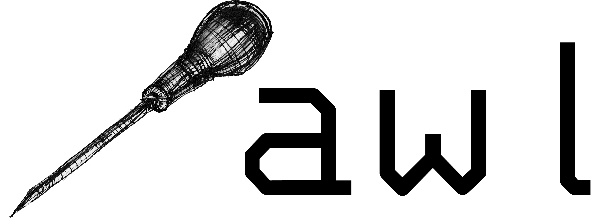

# 

> awl *(noun)*: A pointed tool for making small holes in wood or leather


A command-line DNS lookup tool that supports DNS queries over UDP, TCP, TLS, HTTPS, DNSCrypt, and QUIC.


[](https://git.froth.zone/sam/awl)
[](https://git.froth.zone/sam/awl/commits/branch/master)
[](https://goreportcard.com/report/dns.froth.zone/awl)
[](https://spdx.org/licenses/BSD-3-Clause.html)


Awl is designed to be a drop-in replacement for [dig](https://bind9.readthedocs.io/en/v9_18_3/manpages.html#dig-dns-lookup-utility).

## Examples

```shell
# Query a domain over UDP
awl example.com

# Query a domain over TCP
awl example.com

# Query a domain over TLS, print as JSON
awl example.com +tls +json
```

For more and the usage, see the [manpage](/wiki/awl.1).

## Installing

On any platform, with [Go](https://go.dev) installed, run the following command to install:

```shell
go install dns.froth.zone/awl@latest
```

Alternatively, many package managers are supported:

<details>
<summary>Linux</summary>

<details>
<summary>Alpine Linux</summary>

Provided by [Gitea packages](https://git.froth.zone/sam/-/packages/alpine/awl-dns) \
***Any distro that uses apk should also work***

```shell
# Add the repository
echo "https://git.froth.zone/api/packages/sam/alpine/edge/main" | tee -a /etc/apk/repositories
# Get the signing key
curl -JO https://git.froth.zone/api/packages/sam/alpine/key --output-dir /etc/apk/keys
# Install
apk add awl-dns
```

</details>

<details>
<summary>Arch</summary>

AUR package available as [awl-dns-git](https://aur.archlinux.org/packages/awl-dns-git/)
```shell
yay -S awl-dns-git ||
paru -S awl-dns-git
```

</details>

<details>
<summary>Debian / Ubuntu</summary>

Provided by [Gitea packages](https://git.froth.zone/sam/-/packages/debian/awl-dns/) \
***Any distro that uses deb/dpkg should also work***

```shell
# Add PGP key
sudo curl https://git.froth.zone/api/packages/sam/debian/repository.key -o /usr/share/keyrings/git-froth-zone-sam.asc
# Add repo
echo "deb [signed-by=/usr/share/keyrings/git-froth-zone-sam.asc]  https://git.froth.zone/api/packages/sam/debian sid main" | sudo tee /etc/apt/sources.list.d/git-froth-zone-sam.list
# Update and install
sudo apt update
sudo apt install awl-dns
```

</details>

<details>
<summary>Fedora / RHEL / SUSE</summary>

Provided by [Gitea packages](https://git.froth.zone/sam/-/packages/rpm/awl-dns/) \
***Any distro that uses rpm/dnf might also work, I've never tried it***

```shell
# Add the repository
dnf config-manager --add-repo https://git.froth.zone/api/packages/sam/rpm.repo ||
zypper addrepo https://git.froth.zone/api/packages/sam/rpm.repo
# Install
dnf install awl-dns ||
zypper install awl-dns
```

</details>

<details>
<summary>Gentoo</summary>

```shell
# Add the ebuild repository
eselect repository add froth-zone git https://git.froth.zone/packaging/portage.git
emaint sync -r froth-zone
# Install
emerge -av net-dns/awl
```

</details>

<details>
<summary><a href="https://brew.sh" nofollow>Homebrew</a></summary>

```shell
brew install SamTherapy/tap/awl
```

</details>
</details>
<br />

<details>
<summary>macOS</summary>

<details open>
<summary><a href="https://brew.sh" nofollow>Homebrew</a></summary>

```shell
brew install SamTherapy/tap/awl
```
</details>
</details>
<br />

<details>
<summary>Windows</summary>

<details open>
<summary><a href="https://scoop.sh" nofollow>Scoop</a></summary>

```pwsh
scoop bucket add froth https://git.froth.zone/packages/scoop.git
scoop install awl
```
</details>
</details>

## License
[BSD-3-Clause](https://spdx.org/licenses/BSD-3-Clause.html)

### Credits
- Awl image taken from [Wikimedia Commons](https://commons.wikimedia.org/wiki/File:Awl.tif), imaged is licensed CC0.
